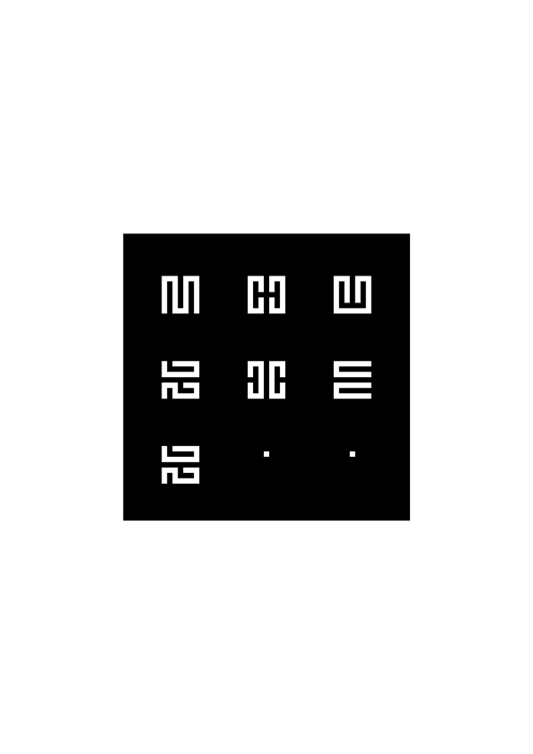
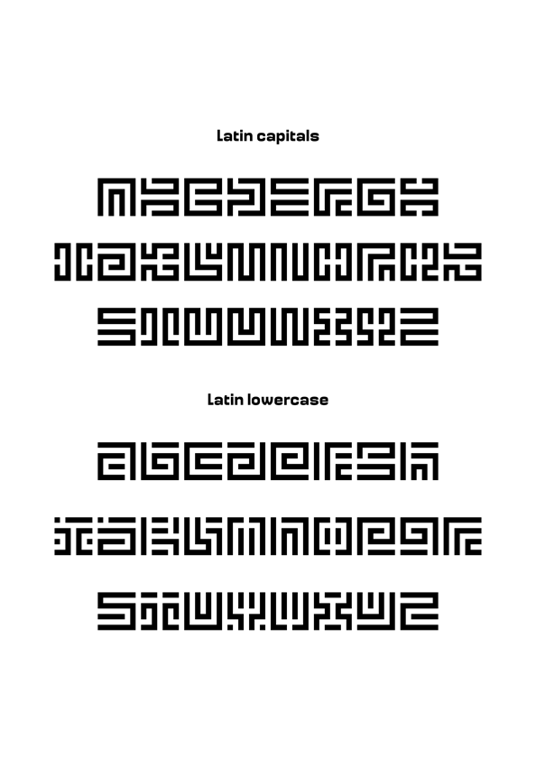
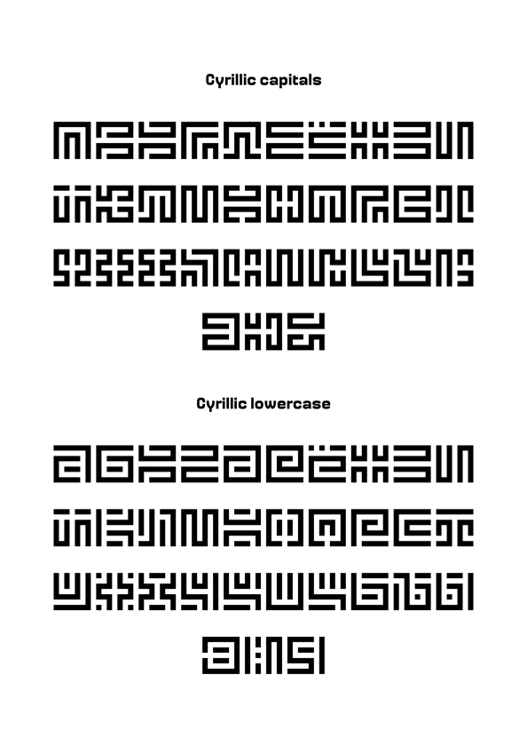

# Mourier

Mourier is a geometric alphabet designed by Eric Mourier in 1971 following a strict set of rules. The font is based on a square of 7 x 7 units and made of unclosed lines. The first and only use of the lead-cast font was on the booklet "The Myth about Bird B", a leporello design by Mourier and written by Knud Holten (a poet).

In 2002, Sébastien Hayez adapted the typeface as a digital font, with the approval of its original designer (thanks to him), which was afterwards published as part of the Velvetyne Type Foundry collection in 2011. Then, in 2020, Ukraininan designer Alex Ash (Alexander Kondratenko) proposed a Cyrillic alphabet expansion of the font, of which he had imagined the capitals. Ariel Martín Perez took this opportunity and developped lowercase letters for Latin and Cyrillic scripts (with feedback from Alex Ash for the Cyrillic), added diacritics and symbols, mastered the font and also created several sets of alternates.

About the original design, in Eric Mourier's own words:

"About the lettering, it may be stated that the individual letters have been designed on the basis of a rigorous, detailed scheme: Forty-nine squares, black and white in rows alternately, no closed areas, gaps the size of one square, etc. Within this scheme, the aim has been to obtain the greatest possible likeness to ‘ordinary’ letters, and, simultaneous, a logical system of forms. The letters c and u, k and y, a and v, to exemplify, are identical, only variously turned.

The letters have been transferred to film, cut apart, and mounted seperately on self-adhesive foil, page by page."

If you want to contribute to Mourier, please follow the original rules of the typeface :)

Mourier is a typeface by Eric Mourier, with contributions by 
[Sébastien Hayez](http://sebastienhayez.fr/), Alexander Kondratenko and [Ariel Martín Perez](http://www.arielgraphisme.com).
Contribute or download it on [Velvetyne Type Foundry](http://velvetyne.fr/fonts/mourier/).

## Specimen

## License

Mourier is licensed under the SIL Open Font License, Version 1.1.
This license is copied as an attached file, and is also available 
with a FAQ at http://scripts.sil.org/OFL

## Repository Layout

This font repository follows the Unified Font Repository v2.0,
a standard way to organize font project source files. Learn more at
https://github.com/unified-font-repository/Unified-Font-Repository
